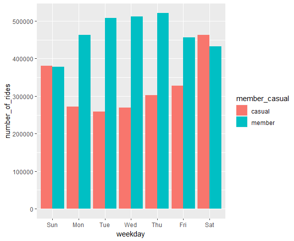

```{r setup, include=FALSE}
knitr::opts_chunk$set(echo = TRUE)
```


## Goal

Explore historical bike trip data to identify key metrics and trends to
drive improvements to the company's marketing strategy.

## Background

Consider a fictitious bike-share company in Chicago. The director of
marketing believes the company's future success depends on maximizing
the number of annual memberships. Therefore, it is required to
understand how casual riders and annual members use the company's bikes
differently. From these insights, a new marketing strategy can be
designed to convert casual riders into annual members. Company
executives must approve any recommendations, so they must be backed up
with compelling data insights and professional data visualizations.

## Methodology

#### 1-extract-data.R

We started by downloading the public data sets from the AWS S3 bucket.
We choose the latest complete year of data, which is from January 2022
(202201) to December 2022 (202212). Since each data set is a zip file,
we created a script to scrape and unzip the csv files to our project's
data folder.

#### 2-load-data.R

The next step is to read in all of the CSV files inside the directory
and build one large data set by merging each of the smaller data sets
together as diagrammed below. 

Since we have a particularly large number of files, a loop can take some
time. Therefore, it is advantageous to use the fread() function from the
data.table package. This function is highly optimized and is much
quicker than other functions for reading in large data files.

#### 3-transform-data.R

At this point, our combined data set consists of 13 columns of 5,667,717
rows. The data format is long, so we can now start adding columns
representing calculated values of interest to our analysis.

There are a few problems we will need to fix:

-   We will want to add a calculated field "ride_time" to the entire
    data frame for analysis of how long each bike-share trip lasted.

-   There are a few lines where started and ended times seem
    suspiciously close to each other. These "non-rides" should be
    excluded from analysis by removing all trips that are less than a
    minute.

-   The data can only be aggregated at the ride-level, which is too
    granular. We will want to add some additional columns of data --
    such as day, month, year -- that provide additional opportunities to
    aggregate the data.

#### 4-analyze-data.R

Now we can start doing our exploratory analysis. We start with a few
aggregations of mean and median ride_times split across the member vs
casual categories. Then we generate a few plots to visualize the
differences between member and casual usage.

#### 5-export-data.R

Finally, we export a few of our aggregate calculations to CSV files for
further analysis or presentations.

## Results

The first thing we notice from the preliminary analysis is that casuals
tend to have longer trips than members:

```         
member_casual      ride_time (min)

casual             29.75593
member             12.99177
```

This would imply that members rent bikes for commuting or other focused
intentions like commuting or errands whereas casuals rent bikes for
leisure or scenic rides.

The second thing we notice is that casual trips on weekends are much
longer than their weekday counterparts. Whereas member trips are more
consistent weekend or weekday.

```         
day_of_week         member_casual      ride_time (min)

1                   casual             34.77775
2                   casual             29.78813
3                   casual             26.36376
4                   casual             25.25931 
5                   casual             26.07710 
6                   casual             28.63388 
7                   casual             33.30770 

1                   member             14.35764 
2                   member             12.53066
3                   member             12.38177 
4                   member             12.36430 
5                   member             12.55655 
6                   member             12.80298 
7                   member             14.47336
```

When calculate the number_of_rides each type of user books on average
and plot that against the day_of_week, we see that members and casuals
have similar bookings on the weekend. However, members book many more
rides during the weekdays than casuals.



This hints that incentives for commuting passes or other weekday
promotions may entice casuals to become members.

## Dependencies

**NOTE: Execute this script only for first call to initialize
environment**

This list of commands in located in the 0-config.R file.

```         
install.packages("archive")
install.packages("lubridate")
install.packages("data.table")
install.packages("tidyverse")
install.packages("ggplot2")
```
